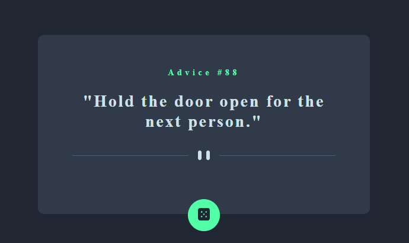

# Frontend Mentor - Advice generator app solution

This is a solution to the [Advice generator app challenge on Frontend Mentor](https://www.frontendmentor.io/challenges/advice-generator-app-QdUG-13db). Frontend Mentor challenges help you improve your coding skills by building realistic projects.

## Table of contents

- [Overview](#overview)
  - [The challenge](#the-challenge)
  - [Screenshot](#screenshot)
  - [Links](#links)
- [My process](#my-process)
  - [Built with](#built-with)  
  - [Continued development](#continued-development)  
- [Author](#author)

## Overview

  This is a solution to Frontend Mentor's advice generator challenge. 

### The challenge

Users should be able to:

- View the optimal layout for the app depending on their device's screen size
- See hover states for all interactive elements on the page
- Generate a new piece of advice by clicking the dice icon

### Screenshot

### Links

- Solution URL: https://github.com/jenniferyoung2016/advice-generator-frontend-mentor

- Live Site URL: https://jenniferyoung2016.github.io/advice-generator-frontend-mentor/

## My process

JavaScript

I first start with the code using JavaScript Fetch API to connect with adviceslip.com's api by defining an asynchronous function, getAdvice(), to get the data, and then convert it to JSON. 

Since I now had access to the Response object, I made a call to a reusable function, checkFetch(), which will catch any failed HTTP responses, such as the 404 Bad Request. 

I added an event listener so that as soon as the document's contents has loaded, it will make a call to the asynchronous function, loadData(), to load the data and then display it on the page and to handle errors such as reference or syntax errors, I used try/catches. 

To prevent the entire page from loading every time the reset button is clicked, I attached an event listener to the reset button and after the button is clicked, the loadData() function is called which only load new data instead of the entire page. 

Design

Since the design was a simple, centered layout, I used Flexbox. The flex container properties, justify-content and align-items, both set to center, centers the page elements perfectly. 

Accessibilty

To make the page accessible for all users, I used semantic elements such as main, section, button, and footer so that there are landmarks for assistive technology to easily navigate and interact with the page. 

Only a level-one header was used since there was only one main section. 

I made the pattern images decorative by adding the attribute aria-hidden set to true and leaving the alt attribute of the images blank so that screen readers don't try and read the file name and confuse the user. 

To help with the visual focus, I added tab indexes to all the important interactive elements. I left the default styling of the focus so that it is easily recognized by users.

For zoom capabilities, I used relative units like rem and em instead of fixed units. 

### Built with

- Semantic HTML5 markup
- CSS custom properties
- Flexbox
- Mobile-first workflow
- JS Fetch API

### Continued development

I'm still working on error handling and accessibility. 

## Author

- Frontend Mentor - [@jenniferyoung2016](https://www.frontendmentor.io/profile/jenniferyoung2016)

